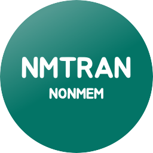
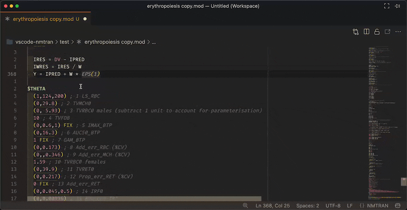
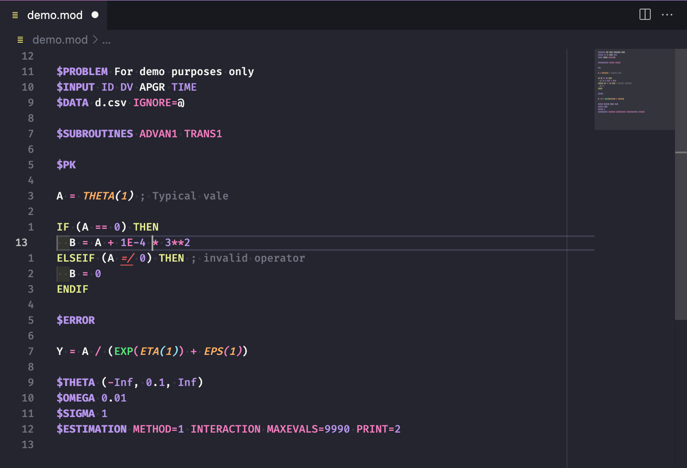
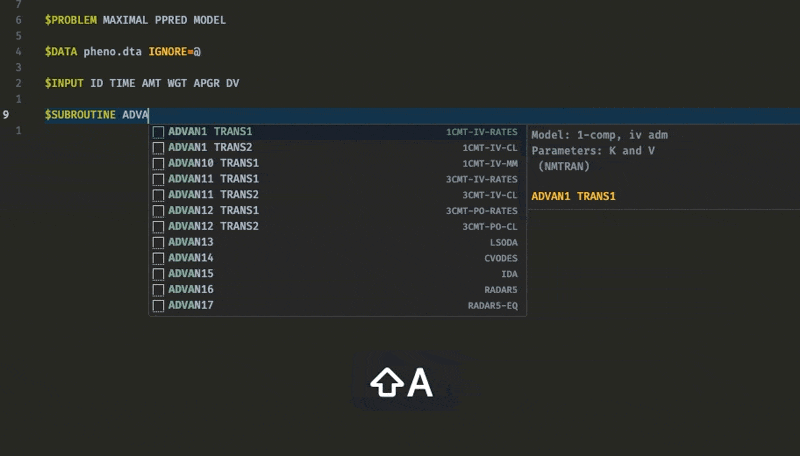

# NMTRAN (NONMEM) Language Extension for VSCode 

> [!NOTE]
> This extension is currently in active development.
> While stable for daily use, expect occasional breaking changes.
> Please report any issues to help improve the extension.

Comprehensive language support for NMTRAN (NONMEM Translator) files in Visual Studio Code. Provides intelligent features for pharmacometric modeling with NONMEM control streams.

## What is NMTRAN?

[NMTRAN](https://nmhelp.tingjieguo.com) is the control language for [NONMEM](https://www.iconplc.com/solutions/technologies/nonmem/), the gold standard software for population pharmacokinetic/pharmacodynamic (PopPK/PD) modeling in pharmaceutical research.
NMTRAN files (`.mod`, `.ctl`) define models for analyzing time-varying dose-concentration and exposure-response relationships.

## Installation

The NMTRAN extension is available for **VSCode** and **VSCode-based editors**, including [Positron](https://github.com/posit-dev/positron).

**Install via Extensions View:**
- Open your code editor
- Make sure you have the latest version of the editor (requirement VSCode v1.102.0+)
- Open the Extensions View
- Search for `NMTRAN` or `nonmem`
- Click "Install" on the NMTRAN extension by vrognas

> [!TIP]
> For an enhanced NMTRAN development experience, consider installing **[ErrorLens](https://github.com/usernamehw/vscode-error-lens)**.
> It makes diagnostics stand out more prominently, highlighting the entire line wherever a diagnostic is generated and printing the message inline.
> Perfect for spotting NMTRAN validation errors at a glance.

## Quick start

Once installed, open any NMTRAN file (`.mod`, `.ctl`) to automatically activate the extension:

Try these features:
- **Hover** over THETA/ETA/EPS to see definitions; control records to see explanations.
- **Right-click** on `THETA(1)` → "Peek" → "Peek References"
- Notice real-time **error highlighting** for invalid syntax

## Features

### 🧠 Language intelligence

- **Real-time diagnostics**: Validation of control records, parameter sequences, and NMTRAN syntax
- **Intelligent hover**: Explanations for control records, parameters, and NONMEM functions
- **Go to Definition**: Navigate from parameter usage (`THETA(1)`) to declaration (`$THETA`)
- **Find All References**: Locate all usages of parameters throughout your model

### ✨ Code enhancement

- **Syntax highlighting**: Rich tokenization following TextMate conventions
- **Code folding**: Collapse control records for better file navigation
- **Smart formatting**: Configurable indentation and code organization
- **Comment toggling**: Quick comment/uncomment with standard VSCode commands

### 📝 Code snippets

Comprehensive snippet library for rapid model development:

**Available snippets:**
- **Subroutines**: ADVAN/TRANS combinations for PK modeling
- **Data handling**: `$DATA` record templates with common options
- **Error models**: Additive, proportional, and combined residual error models
- **Tables**: Xpose-friendly `$TABLE` configurations
- **Mixture models**: 2-way and 3-way mixture model templates
- **Special modeling**:
  - Logit-normal IIV for bounded parameters
  - Baseline models (B1--B4) [Dansirikul et al., 2008](https://doi.org/10.1007/s10928-008-9088-2)
  - BQL handling (M3 method) [Beal, 2001](https://doi.org/10.1023/a:1012299115260)

## Supported file types
https://github.com/vrognas/vscode-nmtran/blob/main/README.md
The extension activates for these NONMEM-related file extensions:

- **Control streams**: `.mod`, `.ctl`, `.modt`
- **Output files**: `.lst`, `.ext`, `.cov`, `.cor`, `.coi`, `.cnv`
- **Special files**: `.phi`, `.scm`, `.grd`, `.shk`, `.shm`, `.smt`, `.rmt`, `.phm`

## Community & support

- **Documentation**: [NMTRAN Reference](https://nmhelp.tingjieguo.com)
- **Issues & Feature Requests**: [GitHub Issues](https://github.com/vrognas/vscode-nmtran/issues)
- **Discussions**: [GitHub Discussions](https://github.com/vrognas/vscode-nmtran/discussions)
- **Contributing**: See [CONTRIBUTING.md](CONTRIBUTING.md)
- **Sponsor**: [Buy me a coffee ☕](https://buymeacoffee.com/vrognas)

## Contributing

Whether you're fixing bugs, adding features, or improving documentation, your help makes this extension better for the pharmacometrics community.

- 🐛 **Bug reports**: [GitHub Issues](https://github.com/vrognas/vscode-nmtran/issues)
- 💡 **Feature requests**: [GitHub Discussions](https://github.com/vrognas/vscode-nmtran/discussions)
- 🔧 **Pull requests**: See [CONTRIBUTING.md](CONTRIBUTING.md) for guidelines
- 📖 **Documentation**: Help improve our docs and examples

## License

[MIT License](LICENSE) - feel free to use this extension in your research and commercial projects.

---

**Enjoy enhanced NMTRAN development!** 🧬💊

*Made with ❤️ for the pharmacometrics community*
